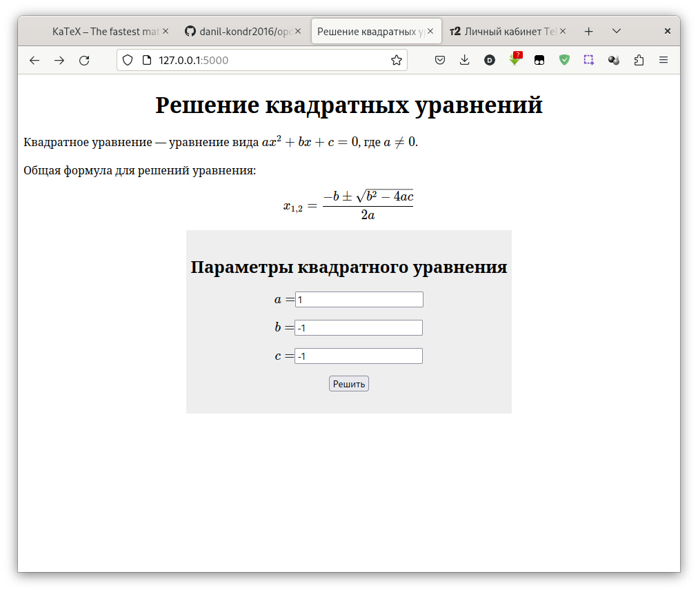
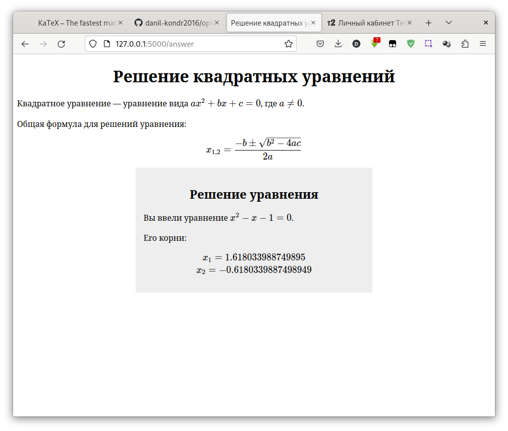
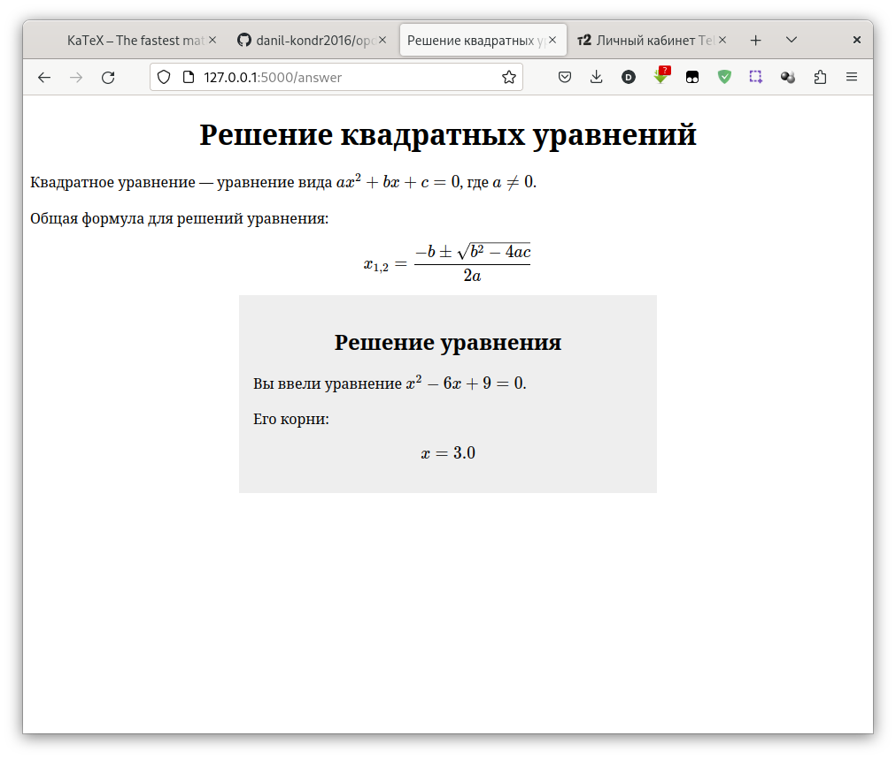
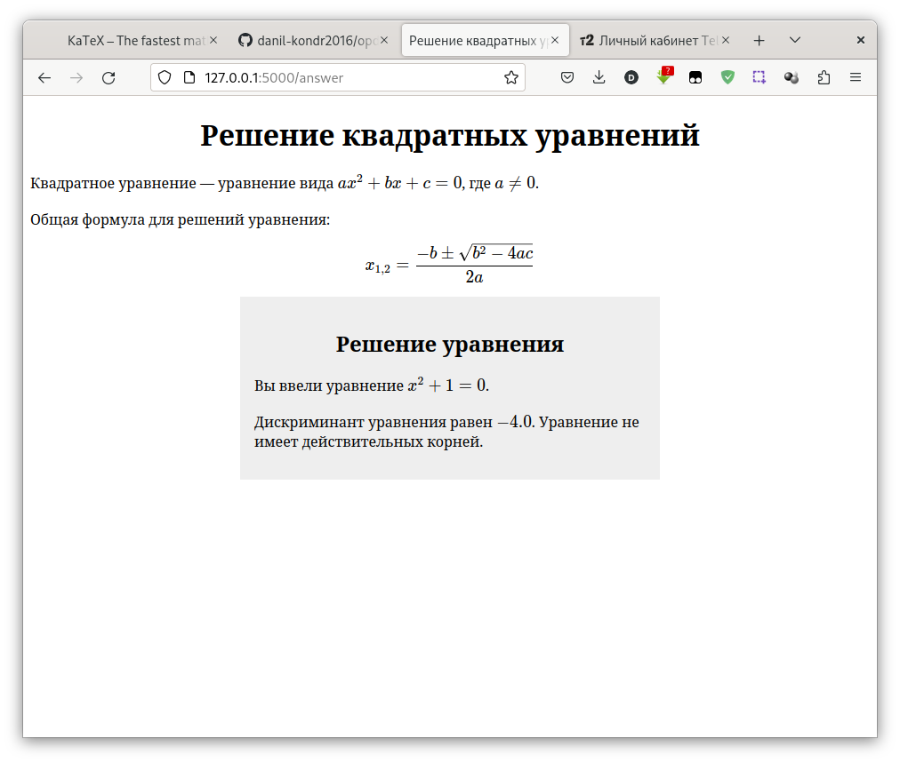

Лабораторная работа №3
======================

**Задание:** разработать веб-приложение для решения квадратных уравнений с использованием Flask.

Для отрисовки формул в тексте страницы используется библиотека [KaTeX](https://katex.org).

Ход работы веб-приложения
-------------------------

В начале работы пользователю предлагается ввести коэффициенты квадратного уравнения, корни которого он хочет найти.

В зависимости от дискриминанта уравнения есть три возможных исхода:

Когда дискриминант больше нуля, программа показывает два действительных корня.

Когда дискриминант равен нулю, программа отображает только один корень, поскольку
оба корня одинаковые.

Если дискриминант меньше нуля, программа даёт понять, что у уравнения нет действительных
корней. 